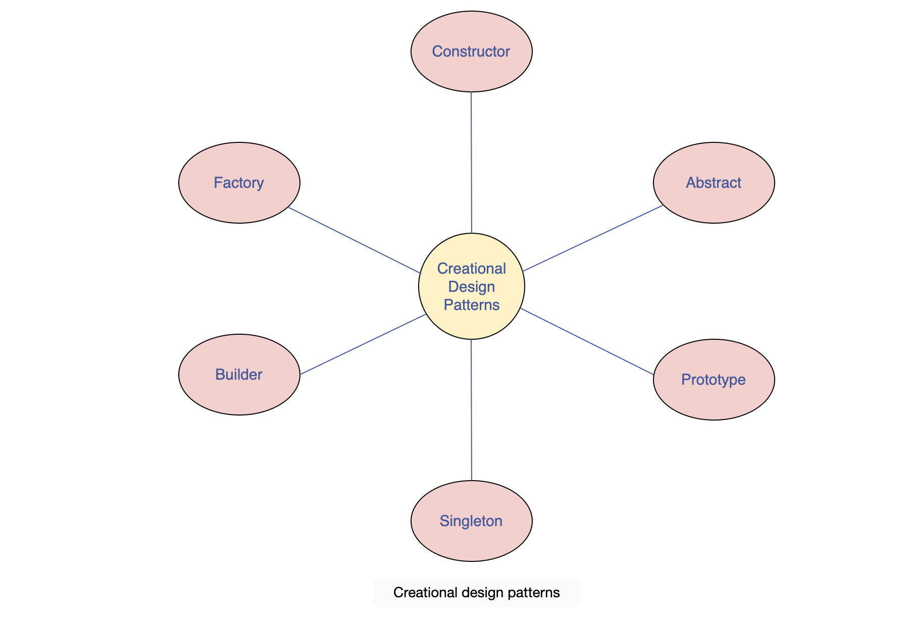
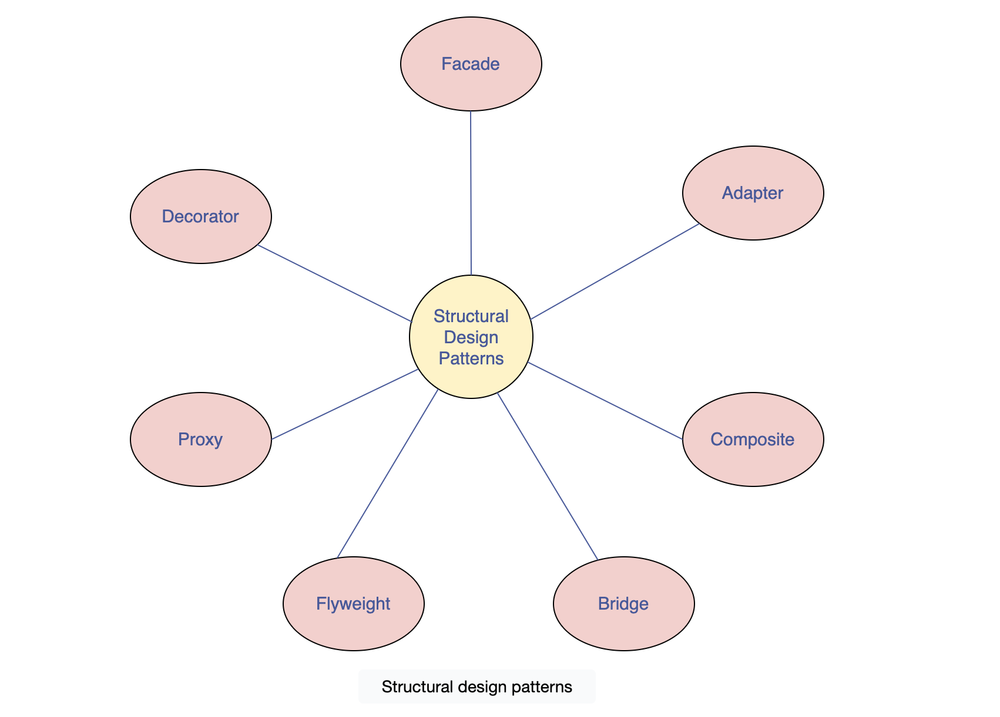
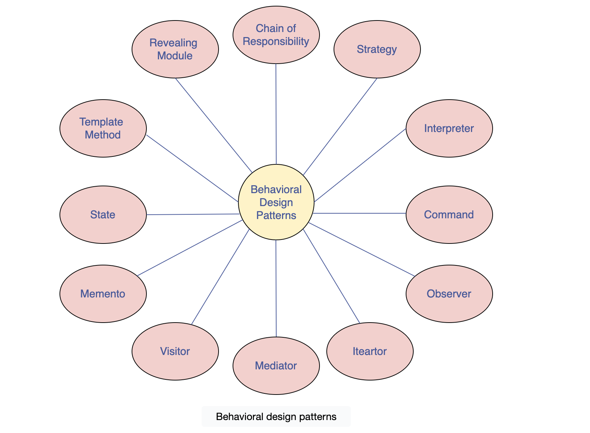
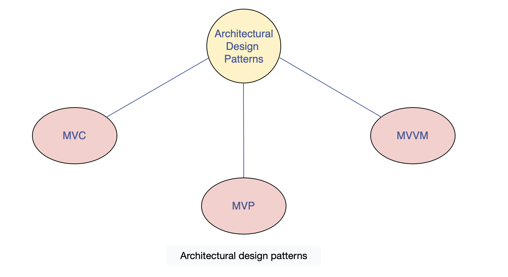
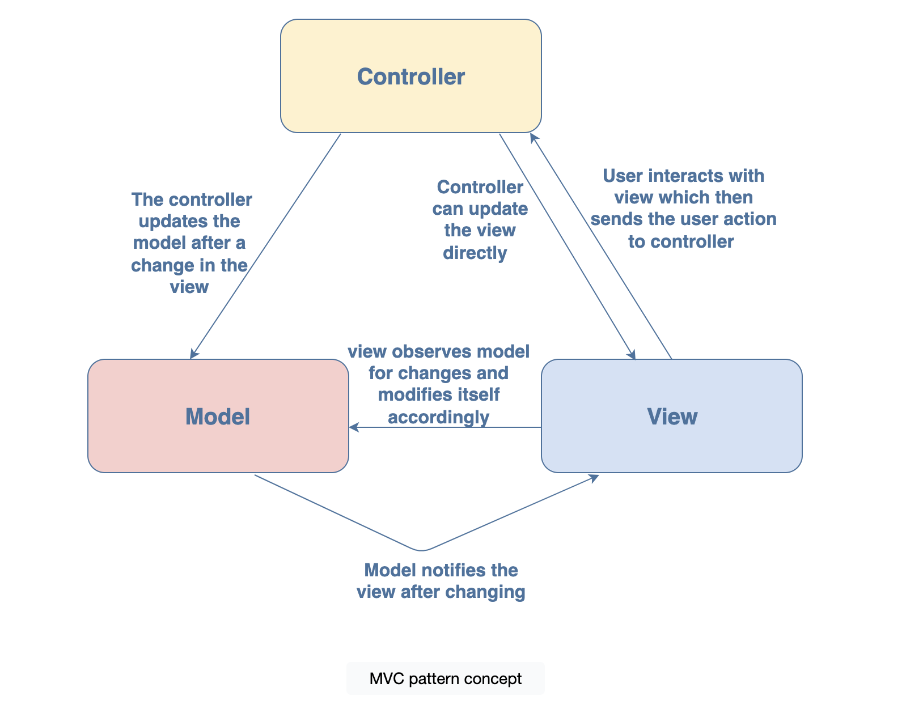
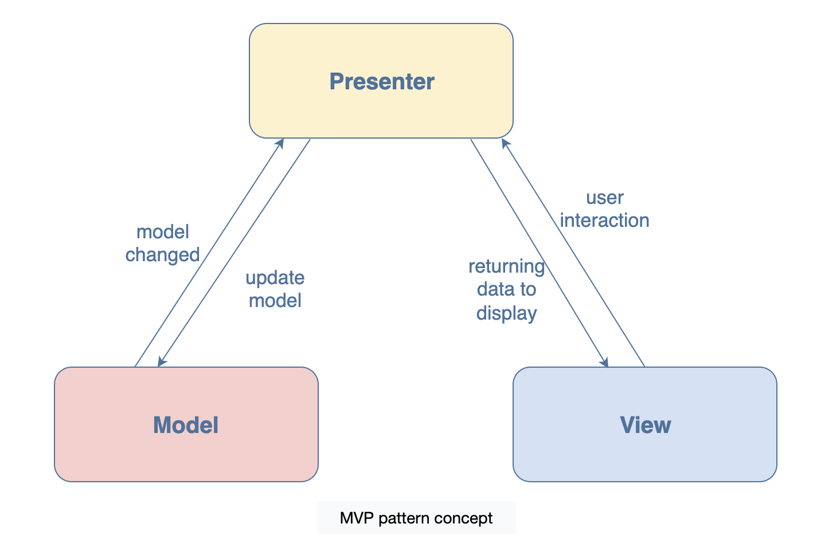
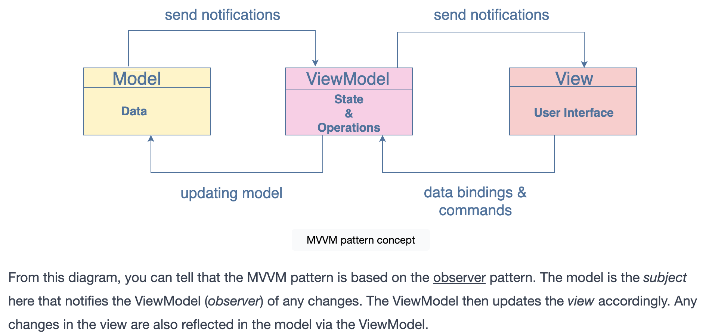

# Design Patterns

1. Creational design patterns
2. Structural design patterns
3. Behavioral design patterns
4. Architectural design patterns

## Creational design patterns

These patterns are used to provide a mechanism for creating objects in a specific situation without revealing the creation method.



## Structural design patterns

These patterns concern class/object composition and relationships between objects. They let you add new functionalities to objects so that restructuring some parts of the system does not affect the rest. Hence, when some parts of structure change, the entire system does not need to change.


## Behavioral design patterns
These patterns are concerned with communication between dissimilar objects in a system. They streamline the communication and make sure the information is synchronized between such objects.



## Architectural design patterns

These patterns are used for solving architectural problems within a given context in software architecture.



# Architectural design patterns

## MVC Pattern
The MVC pattern stands for model view controller pattern. It is an architectural pattern used to organize the code of your application. It consists of three components:

- Model:
This is the model component that manages the data that the application may require.

- View:
The view is used for the visual representation of the current model. It renders data on the user’s side.

- Controller:
The controller connects the model and the view components.



When to use the MVC pattern?
You can use this pattern if you want:

- improved application organization in your application
- faster development so that developers can work on different components of the application simultaneously
- to develop an application that loads fast as MVC supports asynchronous technique
- multiple views for the model
- to increase the scalability of the application as modification in separate components is easier

## MVP Pattern

The MVP pattern stands for model view presenter. It is derived from the MVC pattern, which focuses on the user interface. MVP however, is focused on improving the presentation logic.

It consists of three components:

- Model: provides the data that the application requires, which we want to display in the view

- View: to display the data from the model, it passes the user actions/commands to the presenter to act upon that data

- Presenter: acts as the middle man between the model and the view. Retrieves data from the model, manipulates it, and returns it to view for display. It also reacts to the user’s interaction with the view.

### MVC (Model-View-Controller)
- Controller acts as a mediator: The Controller manages the flow of data between the Model (data/business logic) and the View (UI).
- Multiple Views: A single Controller can serve multiple Views, making it versatile for managing different UI components.
- Direct Communication: In MVC, the View can observe the Model directly for changes, automatically updating itself when data changes.

### MVP (Model-View-Presenter)
- Presenter acts as a mediator: The Presenter handles interactions between the View and the Model, isolating the View from the Model entirely.
- One-to-One Mapping: Each View in MVP has its own Presenter. For complex UIs, multiple Presenters can be used to manage different parts of the View.
- Separation of Concerns: The Model and View are fully decoupled. The Presenter retrieves and manipulates data from the Model and updates the View accordingly.




When to use the MVP pattern?#
You can use this pattern:

- If your application requires a lot of reuse of the presentation logic
- If your application requires a lot of user interaction
- If your application has complex views
- For easier testing as the presenter can provide a mock interface that can be unit tested.

### MVVM

The MVVM pattern stands for model view viewModel pattern. It is based on the MVC and MVP patterns discussed in the previous lessons. It is used to further separate the working of the user interface from the business logic in the application.

- Model: As seen in the MVC and MVP patterns, the model stores all the data and information required by the application. As you know, the model does not interfere with how this data will be manipulated or displayed.

- View: The view displays the information on the interface. It can also accept user input, hence, it contains behavior. In the MVVM pattern, the views aren’t passive. Passive views are manipulated by the controller or presenter and are responsible for displaying the information without having any knowledge of the model. However, in MVVM, views are active. They contain data-bindings, behavior, and events that require the knowledge of model and ViewModel. The view handles its events and it doesn’t depend on the ViewModel entirely. However, it does not maintain its state, for that, it syncs up with the ViewModel.

- ViewModel: Similar to the controller in the MVC, the ViewModel acts as the connection between the model and the view. It converts information from the model format to the view format for display. For example, the model might have a date stored in Unix format, whereas the view might display it in another format. Here, the ViewModel will help in converting the information. It also updates the model when a user action on the view occurs and is used to pass commands from view to the model. It is also used to maintain the view’s state and trigger events on it.

### View and ViewModel
The view and ViewModel communicate via events, data binding, and method calls. While view maps its events to the ViewModel through commands, the ViewModel exposes model properties that are updated by the view through two-way data binding.

### Model and ViewModel
ViewModel exposes the model and its properties for data binding. It also contains interfaces to fetch and format the properties it displays to the view.


When to use the MVVM pattern?
You can use this pattern if you want:
- to display the data stored in the model in a different format on the view side
- to slim down the model’s number to view transformations that the controller is handling in MVC
- to make your application more maintainable, reusable, and extendable

MVC vs MVP vs MVVM Design Patterns
1. MVC (Model-View-Controller)
- Controller as Mediator: The Controller acts as an intermediary between the View (UI) and the Model (business logic/data). It handles user input and updates the Model or View accordingly.
- Direct Communication: The View can directly observe the Model for changes and update itself automatically.
- One-to-Many Relationships: A Controller can be shared across multiple Views.
- Use Cases: Often used in web applications where the View and Controller interaction is straightforward.
2. MVP (Model-View-Presenter)
- Presenter as Mediator: In MVP, the Presenter handles all interactions between the View and Model. Unlike MVC, the View does not directly communicate with the Model. The Presenter updates the View with data from the Model.
- One-to-One Relationship: Each View has its own Presenter. For more complex Views, you may have multiple Presenters.
- Separation of Concerns: The View is passive and relies on the Presenter to act on the Model and update the View.
- Use Cases: Often used in desktop or mobile apps with more complex UI interactions.
3. MVVM (Model-View-ViewModel)
- ViewModel as Mediator: The ViewModel holds the business logic and UI state, providing data to the View through data-binding mechanisms. It listens for changes in the Model and updates the View automatically.
- Two-Way Data Binding: One of the key features of MVVM is two-way data binding between the View and ViewModel. When the View changes, the ViewModel is updated, and vice versa.
- No Direct Communication: The View does not directly interact with the Model; instead, it binds to properties in the ViewModel, which acts as an abstraction of the View.
- xUse Cases: Commonly used in frameworks that support data binding like WPF, Xamarin, and Angular.

## Example

### MVC

App structure 
```scss
src/
  ├─ components/
      ├─ CounterView.js (View)
      ├─ CounterController.js (Controller)
  ├─ models/
      ├─ CounterModel.js (Model)
  ├─ App.js
```
Model
```js
export class CounterModel {
  constructor() {
    this.value = 0;
  }

  increment() {
    this.value += 1;
  }

  decrement() {
    this.value -= 1;
  }

  getValue() {
    return this.value;
  }
}
```
Controller
```js
export class CounterController {
  constructor(model) {
    this.model = model;
  }

  increment() {
    this.model.increment();
  }

  decrement() {
    this.model.decrement();
  }

  getValue() {
    return this.model.getValue();
  }
}
```
View 
```js
import React from "react";

export const CounterView = ({ value, onIncrement, onDecrement }) => {
  return (
    <div>
      <h1>Counter: {value}</h1>
      <button onClick={onIncrement}>Increment</button>
      <button onClick={onDecrement}>Decrement</button>
    </div>
  );
};
```
Main App
```js
import React, { useState } from "react";
import { CounterView } from "./components/CounterView";
import { CounterController } from "./components/CounterController";
import { CounterModel } from "./models/CounterModel";

function App() {
  const model = new CounterModel();
  const controller = new CounterController(model);

  const [value, setValue] = useState(controller.getValue());

  const handleIncrement = () => {
    controller.increment();
    setValue(controller.getValue());
  };

  const handleDecrement = () => {
    controller.decrement();
    setValue(controller.getValue());
  };

  return (
    <div>
      <CounterView
        value={value}
        onIncrement={handleIncrement}
        onDecrement={handleDecrement}
      />
    </div>
  );
}

export default App;
```

### MVP (Model-View-Presenter)

App Structure
```scss
src/
  ├─ components/
      ├─ CounterView.js (View)
      ├─ CounterPresenter.js (Presenter)
  ├─ models/
      ├─ CounterModel.js (Model)
  ├─ App.js

```
Model: `same as mvc model`

Presenter
```js
export class CounterPresenter {
  constructor(model, updateViewCallback) {
    this.model = model;
    this.updateView = updateViewCallback;
  }

  increment() {
    this.model.increment();
    this.updateView(this.model.getValue());
  }

  decrement() {
    this.model.decrement();
    this.updateView(this.model.getValue());
  }

  getValue() {
    return this.model.getValue();
  }
}
```

View: `Same as MVC view`

Main App
```js
import React, { useState } from "react";
import { CounterView } from "./components/CounterView";
import { CounterPresenter } from "./components/CounterPresenter";
import { CounterModel } from "./models/CounterModel";

function App() {
  const model = new CounterModel();
  const [value, setValue] = useState(model.getValue());

  const presenter = new CounterPresenter(model, setValue);

  return (
    <div>
      <CounterView
        value={value}
        onIncrement={() => presenter.increment()}
        onDecrement={() => presenter.decrement()}
      />
    </div>
  );
}

export default App;
```

### MVVM

App Structure:
```scss
src/
  ├─ components/
      ├─ CounterView.js (View)
  ├─ viewmodels/
      ├─ CounterViewModel.js (ViewModel)
  ├─ App.js
```

ViewModel:
```js
import { useState } from "react";

export const useCounterViewModel = () => {
  const [value, setValue] = useState(0);

  const increment = () => setValue((prev) => prev + 1);
  const decrement = () => setValue((prev) => prev - 1);

  return { value, increment, decrement };
};
```

View: `Same as MVC View`

Main App:
```js
import React from "react";
import { CounterView } from "./components/CounterView";
import { useCounterViewModel } from "./viewmodels/CounterViewModel";

function App() {
  const { value, increment, decrement } = useCounterViewModel();

  return (
    <div>
      <CounterView
        value={value}
        increment={increment}
        decrement={decrement}
      />
    </div>
  );
}

export default App;
```