# Design Patterns

1. Creational design patterns
2. Structural design patterns
3. Behavioral design patterns
4. Architectural design patterns

## Creational design patterns

These patterns are used to provide a mechanism for creating objects in a specific situation without revealing the creation method.


## Structural design patterns

These patterns concern class/object composition and relationships between objects. They let you add new functionalities to objects so that restructuring some parts of the system does not affect the rest. Hence, when some parts of structure change, the entire system does not need to change.


## Behavioral design patterns
These patterns are concerned with communication between dissimilar objects in a system. They streamline the communication and make sure the information is synchronized between such objects.


## Architectural design patterns

These patterns are used for solving architectural problems within a given context in software architecture.


# Architectural design patterns

## MVC Pattern
The MVC pattern stands for model view controller pattern. It is an architectural pattern used to organize the code of your application. It consists of three components:

- Model:
This is the model component that manages the data that the application may require.

- View:
The view is used for the visual representation of the current model. It renders data on the user’s side.

- Controller:
The controller connects the model and the view components.


When to use the MVC pattern?
You can use this pattern if you want:

- improved application organization in your application
- faster development so that developers can work on different components of the application simultaneously
- to develop an application that loads fast as MVC supports asynchronous technique
- multiple views for the model
- to increase the scalability of the application as modification in separate components is easier

## MVP Pattern

The MVP pattern stands for model view presenter. It is derived from the MVC pattern, which focuses on the user interface. MVP however, is focused on improving the presentation logic.

It consists of three components:

- Model: provides the data that the application requires, which we want to display in the view

- View: to display the data from the model, it passes the user actions/commands to the presenter to act upon that data

- Presenter: acts as the middle man between the model and the view. Retrieves data from the model, manipulates it, and returns it to view for display. It also reacts to the user’s interaction with the view.

### MVC (Model-View-Controller)
- Controller acts as a mediator: The Controller manages the flow of data between the Model (data/business logic) and the View (UI).
- Multiple Views: A single Controller can serve multiple Views, making it versatile for managing different UI components.
- Direct Communication: In MVC, the View can observe the Model directly for changes, automatically updating itself when data changes.

### MVP (Model-View-Presenter)
- Presenter acts as a mediator: The Presenter handles interactions between the View and the Model, isolating the View from the Model entirely.
- One-to-One Mapping: Each View in MVP has its own Presenter. For complex UIs, multiple Presenters can be used to manage different parts of the View.
- Separation of Concerns: The Model and View are fully decoupled. The Presenter retrieves and manipulates data from the Model and updates the View accordingly.


When to use the MVP pattern?#
You can use this pattern:

- If your application requires a lot of reuse of the presentation logic
- If your application requires a lot of user interaction
- If your application has complex views
- For easier testing as the presenter can provide a mock interface that can be unit tested.

### MVVM

The MVVM pattern stands for model view viewModel pattern. It is based on the MVC and MVP patterns discussed in the previous lessons. It is used to further separate the working of the user interface from the business logic in the application.

- Model: As seen in the MVC and MVP patterns, the model stores all the data and information required by the application. As you know, the model does not interfere with how this data will be manipulated or displayed.

- View: The view displays the information on the interface. It can also accept user input, hence, it contains behavior. In the MVVM pattern, the views aren’t passive. Passive views are manipulated by the controller or presenter and are responsible for displaying the information without having any knowledge of the model. However, in MVVM, views are active. They contain data-bindings, behavior, and events that require the knowledge of model and ViewModel. The view handles its events and it doesn’t depend on the ViewModel entirely. However, it does not maintain its state, for that, it syncs up with the ViewModel.

- ViewModel: Similar to the controller in the MVC, the ViewModel acts as the connection between the model and the view. It converts information from the model format to the view format for display. For example, the model might have a date stored in Unix format, whereas the view might display it in another format. Here, the ViewModel will help in converting the information. It also updates the model when a user action on the view occurs and is used to pass commands from view to the model. It is also used to maintain the view’s state and trigger events on it.

### View and ViewModel
The view and ViewModel communicate via events, data binding, and method calls. While view maps its events to the ViewModel through commands, the ViewModel exposes model properties that are updated by the view through two-way data binding.

### Model and ViewModel
ViewModel exposes the model and its properties for data binding. It also contains interfaces to fetch and format the properties it displays to the view.


When to use the MVVM pattern?
You can use this pattern if you want:
- to display the data stored in the model in a different format on the view side
- to slim down the model’s number to view transformations that the controller is handling in MVC
- to make your application more maintainable, reusable, and extendable

MVC vs MVP vs MVVM Design Patterns
1. MVC (Model-View-Controller)
- Controller as Mediator: The Controller acts as an intermediary between the View (UI) and the Model (business logic/data). It handles user input and updates the Model or View accordingly.
- Direct Communication: The View can directly observe the Model for changes and update itself automatically.
- One-to-Many Relationships: A Controller can be shared across multiple Views.
- Use Cases: Often used in web applications where the View and Controller interaction is straightforward.
2. MVP (Model-View-Presenter)
- Presenter as Mediator: In MVP, the Presenter handles all interactions between the View and Model. Unlike MVC, the View does not directly communicate with the Model. The Presenter updates the View with data from the Model.
- One-to-One Relationship: Each View has its own Presenter. For more complex Views, you may have multiple Presenters.
- Separation of Concerns: The View is passive and relies on the Presenter to act on the Model and update the View.
- Use Cases: Often used in desktop or mobile apps with more complex UI interactions.
3. MVVM (Model-View-ViewModel)
- ViewModel as Mediator: The ViewModel holds the business logic and UI state, providing data to the View through data-binding mechanisms. It listens for changes in the Model and updates the View automatically.
- Two-Way Data Binding: One of the key features of MVVM is two-way data binding between the View and ViewModel. When the View changes, the ViewModel is updated, and vice versa.
- No Direct Communication: The View does not directly interact with the Model; instead, it binds to properties in the ViewModel, which acts as an abstraction of the View.
- xUse Cases: Commonly used in frameworks that support data binding like WPF, Xamarin, and Angular.

## Example

### MVC

App structure 
```scss
src/
  ├─ components/
      ├─ CounterView.js (View)
      ├─ CounterController.js (Controller)
  ├─ models/
      ├─ CounterModel.js (Model)
  ├─ App.js
```
Model
```js
export class CounterModel {
  constructor() {
    this.value = 0;
  }

  increment() {
    this.value += 1;
  }

  decrement() {
    this.value -= 1;
  }

  getValue() {
    return this.value;
  }
}
```
Controller
```js
export class CounterController {
  constructor(model) {
    this.model = model;
  }

  increment() {
    this.model.increment();
  }

  decrement() {
    this.model.decrement();
  }

  getValue() {
    return this.model.getValue();
  }
}
```
View 
```js
import React from "react";

export const CounterView = ({ value, onIncrement, onDecrement }) => {
  return (
    <div>
      <h1>Counter: {value}</h1>
      <button onClick={onIncrement}>Increment</button>
      <button onClick={onDecrement}>Decrement</button>
    </div>
  );
};
```
Main App
```js
import React, { useState } from "react";
import { CounterView } from "./components/CounterView";
import { CounterController } from "./components/CounterController";
import { CounterModel } from "./models/CounterModel";

function App() {
  const model = new CounterModel();
  const controller = new CounterController(model);

  const [value, setValue] = useState(controller.getValue());

  const handleIncrement = () => {
    controller.increment();
    setValue(controller.getValue());
  };

  const handleDecrement = () => {
    controller.decrement();
    setValue(controller.getValue());
  };

  return (
    <div>
      <CounterView
        value={value}
        onIncrement={handleIncrement}
        onDecrement={handleDecrement}
      />
    </div>
  );
}

export default App;
```

### MVP (Model-View-Presenter)

App Structure
```scss
src/
  ├─ components/
      ├─ CounterView.js (View)
      ├─ CounterPresenter.js (Presenter)
  ├─ models/
      ├─ CounterModel.js (Model)
  ├─ App.js

```
Model: `same as mvc model`

Presenter
```js
export class CounterPresenter {
  constructor(model, updateViewCallback) {
    this.model = model;
    this.updateView = updateViewCallback;
  }

  increment() {
    this.model.increment();
    this.updateView(this.model.getValue());
  }

  decrement() {
    this.model.decrement();
    this.updateView(this.model.getValue());
  }

  getValue() {
    return this.model.getValue();
  }
}
```

View: `Same as MVC view`

Main App
```js
import React, { useState } from "react";
import { CounterView } from "./components/CounterView";
import { CounterPresenter } from "./components/CounterPresenter";
import { CounterModel } from "./models/CounterModel";

function App() {
  const model = new CounterModel();
  const [value, setValue] = useState(model.getValue());

  const presenter = new CounterPresenter(model, setValue);

  return (
    <div>
      <CounterView
        value={value}
        onIncrement={() => presenter.increment()}
        onDecrement={() => presenter.decrement()}
      />
    </div>
  );
}

export default App;
```

### MVVM

App Structure:
```scss
src/
  ├─ components/
      ├─ CounterView.js (View)
  ├─ viewmodels/
      ├─ CounterViewModel.js (ViewModel)
  ├─ App.js
```

ViewModel:
```js
import { useState } from "react";

export const useCounterViewModel = () => {
  const [value, setValue] = useState(0);

  const increment = () => setValue((prev) => prev + 1);
  const decrement = () => setValue((prev) => prev - 1);

  return { value, increment, decrement };
};
```

View: `Same as MVC View`

Main App:
```js
import React from "react";
import { CounterView } from "./components/CounterView";
import { useCounterViewModel } from "./viewmodels/CounterViewModel";

function App() {
  const { value, increment, decrement } = useCounterViewModel();

  return (
    <div>
      <CounterView
        value={value}
        increment={increment}
        decrement={decrement}
      />
    </div>
  );
}

export default App;
```

# Behavioral Patterns

These patterns ensure effective communication between different objects in a system, assign responsibilities to them, and make sure they all have synchronized information.

These behavioral patterns include:

`Chain of responsibility`

Interpreter

`Command`

`Iterator`

`Mediator`

Memento

State

Template Method

Strategy

`Visitor`

`Observer`

Revealing Module

## Chain of Responsibility Pattern
The chain of responsibility pattern allows a request sent by a client to be received by more than one object. It creates a chain of loosely-coupled objects that, upon receiving the request, either handle it or pass it to the next handler object.

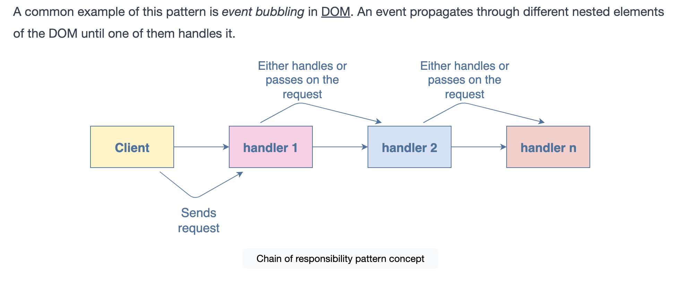

When to use the chain of responsibility pattern?

You can use it if your program is written to handle various requests in different ways without knowing the sequence and type of requests beforehand. It allows you to chain several handlers, thus, allowing all of them a chance to process the request.

## Command Pattern

The command pattern allows encapsulation of the requests or operations into separate objects. It decouples the objects that send requests from the objects responsible for executing those requests.


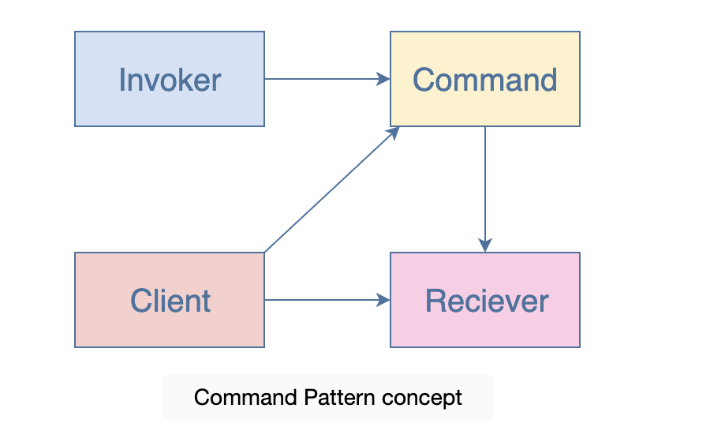

The diagram above captures the essence of the command pattern:

- Invoker: asks the command to carry out the request

- Command: has information about the action and binds it to the receiver by invoking the corresponding operation on it

- Receiver: knows how to perform the operations associated with the command

- Client: creates a command and sets the receiver who’ll receive the command


When to use the command pattern?
You can use it if you want to:

- queue and execute requests at different times
- perform operations such as reset or undo
- keep a history of requests made

## Iterator Pattern

The iterator pattern allows the definition of various types of iterators that can be used to iterate a collection of objects sequentially without exposing the underlying form.

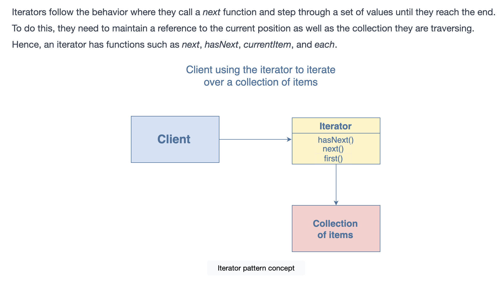

When to use the iterator pattern?

This pattern can be used when dealing with problems explicitly related to iteration, for designing flexible looping constructs and accessing elements from a complex collection without knowing the underlying representation. You can use it to implement a generic iterator that traverses any collection independent of its type efficiently.

## Mediator Pattern

It is a behavioral pattern that allows a mediator (a central authority) to act as the coordinator between different objects, instead of the objects referring to each other directly. A mediator as the name implies, is a central authority through which various components can communicate. It allows the loose coupling of objects.

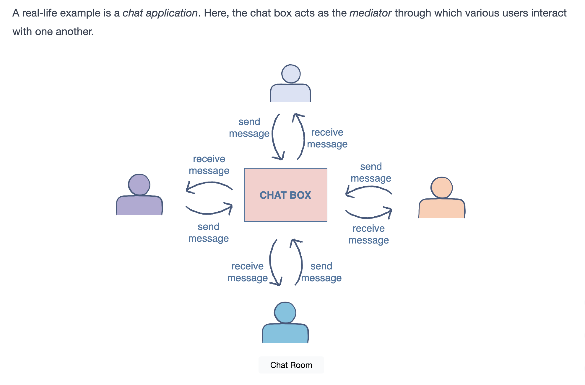

When to use the mediator pattern?
It can be used:
- If your system has multiple parts that need to communicate

- To avoid tight coupling of objects in a system with a lot of objects

- To improve code readability

- To make code easier to maintain

- If communication between objects becomes complex and hinders the reusability of code

## Observer Pattern

The observer pattern is a major behavioral design pattern. It allows objects (observers) that have subscribed to an event to wait for input and react to it when notified. This means they don’t have to continuously keep checking whether the input has been provided or not. The main subject maintains a list of all the observers and whenever the event occurs, it notifies the observers so they can update their states accordingly.

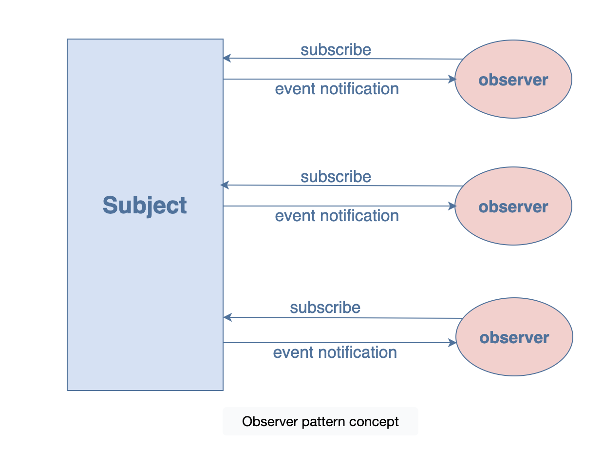

When to use the observer pattern?
The observer pattern can be used to:

- To improve code management by breaking down large applications into a system of loosely-coupled objects

- provide greater flexibility by enabling a dynamic relationship between observers and subscribers which is otherwise not possible due to tight coupling

- improve communication between different parts of the application

- create a one-to-many dependency between objects that are loosely coupled

## Visitor Pattern

The visitor pattern allows the definition of new operations to the collection of objects without changing the structure of the objects themselves. This allows us to separate the class from the logic it implements.

The extra operations can be encapsulated in a visitor object. The objects can have a visit method that accepts the visitor object. The visitor can then make the required changes and perform the operations on the object that received it. This allows the developers to make future extensions, extend the libraries/frameworks, etc.

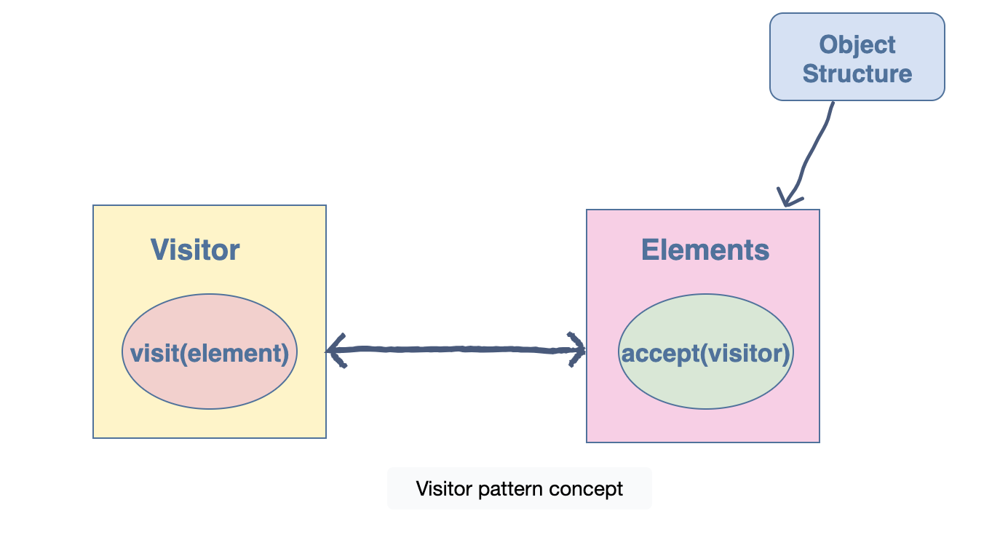

When to use the visitor pattern?#
Visitor pattern can be used when:

- Similar operations need to be performed on different objects of a data structure

- Specific operations need to be performed on different objects in the data structure

- You want to add extensibility to libraries or frameworks

# Structural Design Patterns

In this chapter, we will discuss structural patterns. As the name implies, these patterns are concerned with object relationships and the structure of classes or objects. They help to add new functionality without having to modify the entire system. They ensure that if one part of a system changes, the whole system does not change with it.

The structural patterns we will cover in this chapter include:

- Decorator pattern
- Facade pattern
- Adapter pattern
- Bridge pattern
- Composite pattern
- Flyweight pattern
- Proxy pattern

## Decorator Pattern

The decorator pattern focuses on adding properties, functionalities, and behavior to existing classes dynamically. The additional decoration functionalities aren’t considered essential enough to be a part of the original class definition as they can cause clutter. Hence, the decorator pattern lets you modify the code without changing the original class.

```js
class FrozenYoghurt {
  constructor(flavor, price) {
    this.flavor = flavor
    this.price = price
  }

  orderPlaced() {
    console.log(`The ${this.flavor} flavor will cost you ${this.price} dollars`);
  }
}

// decorator 1
function addFlavors(froyo) {
  froyo.addStrawberry = true;
  froyo.addVanilla = true;
  froyo.price += 20;
  froyo.updatedInfo = function(){
    console.log(`The updated price after adding flavors is ${froyo.price} dollars`)
  }
  return froyo;
}

// decorator 2
function addToppings(froyo) {
  froyo.hasSprinkles = true;
  froyo.hasBrownie =  true;
  froyo.hasWafers = true;
  froyo.allToppings = function(){
    console.log("Your froyo has sprinkles, brownie, and wafers")
  }
  return froyo;
}

//using decorators
//creating a froyo
const froyo = new FrozenYoghurt("chocolate",10)
froyo.orderPlaced()
//adding flavors
var froyowithFlavors = addFlavors(froyo)
froyowithFlavors.updatedInfo()
//adding toppings
var froyoWithToppings = addToppings(froyo)
froyoWithToppings.allToppings()
```

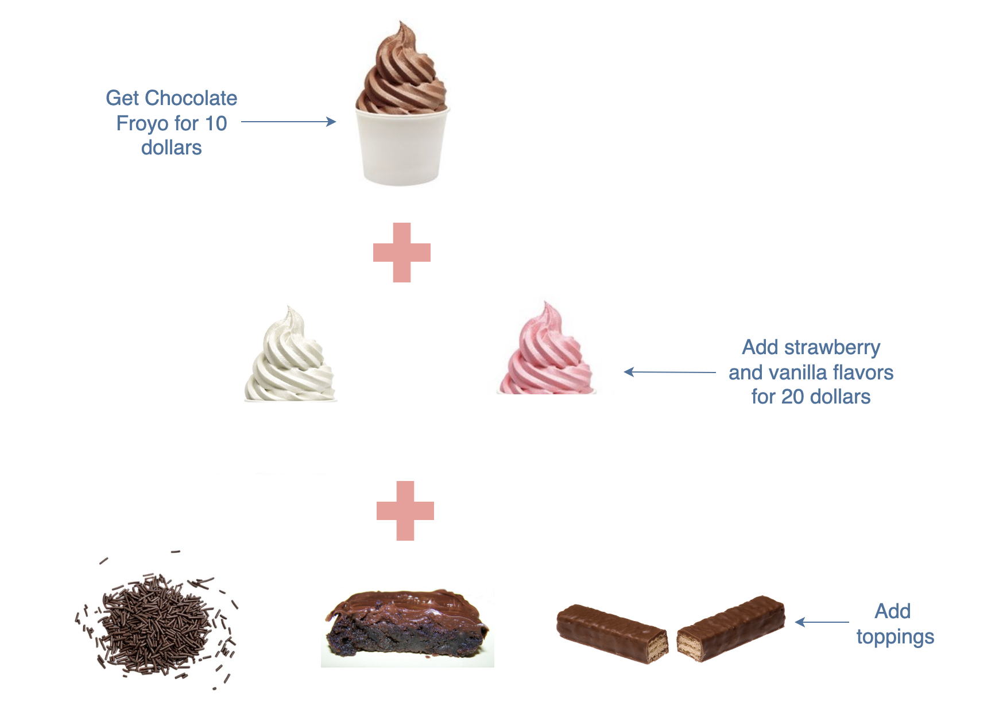

So, how is the decorator pattern being implemented here? Getting the chocolate froyo was the major step. However, the additional flavors and the toppings are both optional. Hence, they are both additional choices that the person may or may not consider. So, both of these steps are not included in the first step, instead, they’re added later on as decoration.

__When to use the decorator pattern?__

JavaScript developers can use the decorator pattern when they want to easily modify or extend the functionality of an object without changing its base code.

It can also be used if an application has a lot of distinct objects with the same underlying code. Instead of creating all of them using different subclasses, additional functionalities can be added to the objects using the decorator pattern.

A simple example is text formatting, where you need to apply different formattings such as bold, italics, and underline to the same text.

## Facade Pattern

the word facade means a deceptive front or appearance. Following this definition, a facade pattern provides a simpler interface that hides the complex functionalities of a system. This is widely used in JavaScript libraries like jQuery.

The facade pattern allows you to hide all the messy logic from the client and only display the clear and easy-to-use interface to them. This allows them to interact with an API easily in a less error-prone way and without accessing the inner workings directly.

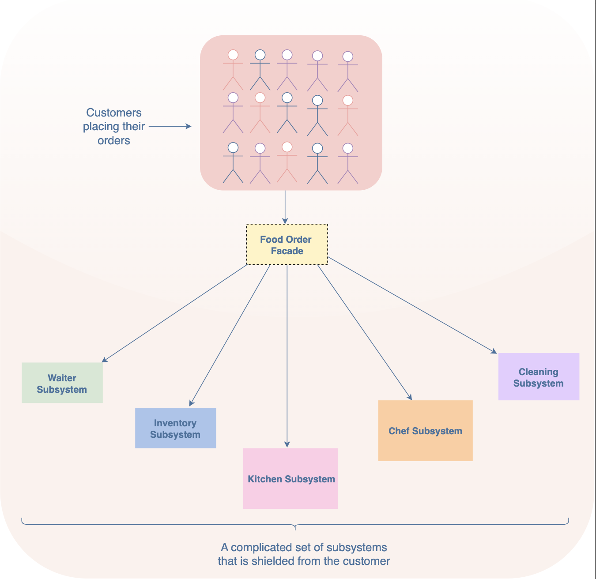

```js
let orderNumber = 0;

class PlaceFoodOrder {
  placeOrder(orderDetails) {
    const orderId = PlaceFoodOrder.generateId();
    let chef;
    if (orderDetails.foodType === 'Main Course') {
      chef = new MainCourseChef();
    } else if (orderDetails.foodType == 'Dessert') {
      chef = new DessertChef();
    }
    return chef.addFoodOrder({ orderId, orderDetails });
  }

  static generateId() {
    return ++orderNumber;
  }
}

class FoodOrders {
  constructor() {
    this.orders = [];
  }

  addFoodOrder(order) {
    this.orders.push(order);
    return this.conveyOrder(order);
  }

  timetoMakeOrder(){}
  conveyOrder(order) {}
}

class MainCourseChef extends FoodOrders {
  constructor() {
    super()
    this.assigned = true
    return this;
  }

  timetoMakeOrder(){
    return Math.floor(Math.random() * 50) + 10  
  }

  conveyOrder({orderId,orderDetails}) {
    const time = this.timetoMakeOrder()
    console.log( `Order number ${orderId}: ${orderDetails.foodDetails} will be served in ${time} minutes.`);
  }
}

class DessertChef extends FoodOrders {
  constructor() {
    super()
    this.assigned = true;
    return this;
  }
 
  timetoMakeOrder(){
    return Math.floor(Math.random() * 30) + 10  
  }

  conveyOrder({ orderId, orderDetails }) {
    const time = this.timetoMakeOrder()
    console.log( `Order number ${orderId}: ${orderDetails.foodDetails} will be served in ${time} minutes.`);
  }
}


const customer = new PlaceFoodOrder();
const order1 = customer.placeOrder({foodType: "Main Course", foodDetails: "Pasta with Shrimps"});
const order2 = customer.placeOrder({foodType: "Dessert", foodDetails: "Molten Lava Cake"});
```
    
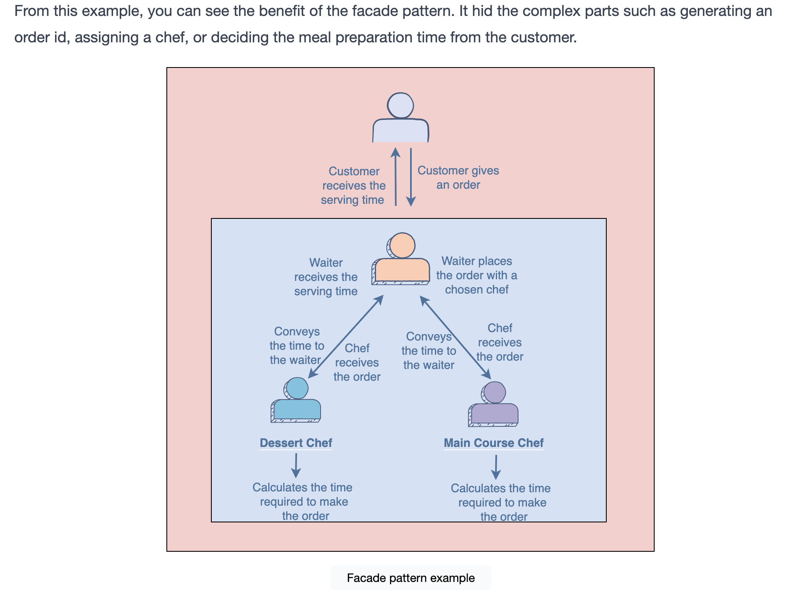

__When to use the facade pattern?__

The facade pattern is used to simplify a client’s interaction with a system. So, it can be used when an application has a large and complex underlying code that the client does not need to see.

It can also be used when you want to interact with the methods present in a library without knowing the processing that happens in the background. An example can be of the JavaScript libraries such as jQuery.

## Adapter Pattern
The adapter pattern allows classes that have different interfaces (properties/methods of an object) to work together. It translates the interface for a class to make it compatible with another class.

This pattern is useful if an API is modified or new implementations are added to it. In this case, if the other parts of a system are still using the old API, the adapter pattern will translate the interface so that the two can work together.

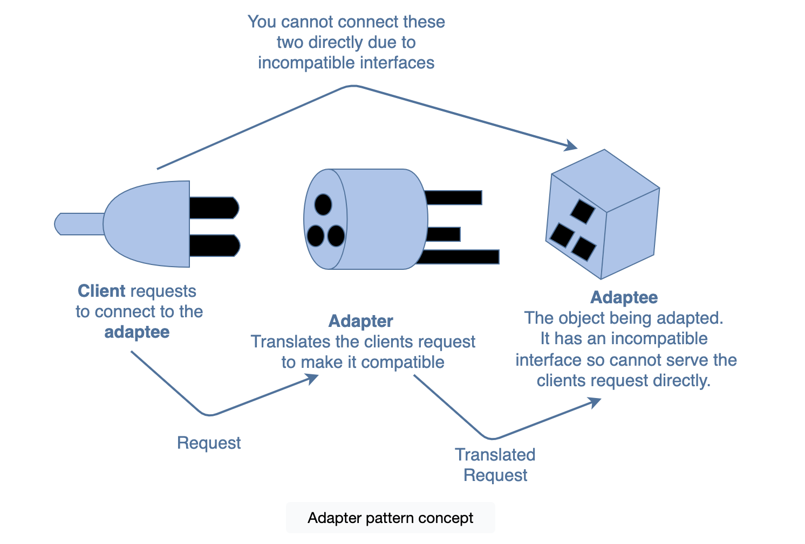

As you can see from the diagram above, the client cannot connect to the adaptee directly as the two interfaces are incompatible. This is where the adapter comes in. It translates the client’s calls to its interface and redirects them into calls to the adaptee (original interface).

```js
class SimpleEarphones{
  constructor(){
    this.attach = function(){
    console.log("Use Earphones with Type C phone")
  }
  }
  
}

class EarPhoneAdapter extends SimpleEarphones{
  constructor(typeCphone){
    super()
    this.attach = function(){
      typeCphone.attach()
    }
  }
}

class TypeCPhone {
  constructor(){
    this.attach = function(){
     console.log("Earphones attached to Type C phone")
  }
  } 
}

var typeCphone = new TypeCPhone()
var adapter = new EarPhoneAdapter(typeCphone)
adapter.attach()
```

__When to use the adapter pattern?__

The adapter pattern is used when we need old APIs to work with new refactored ones or when an object needs to cooperate with a class that has an incompatible interface. It can also be used to reuse the existing functionality of classes.

## Bridge Pattern

The bridge pattern allows separate components with separate interfaces to work together. It keeps an object’s interface separate from its implementation, allowing the two to vary independently.

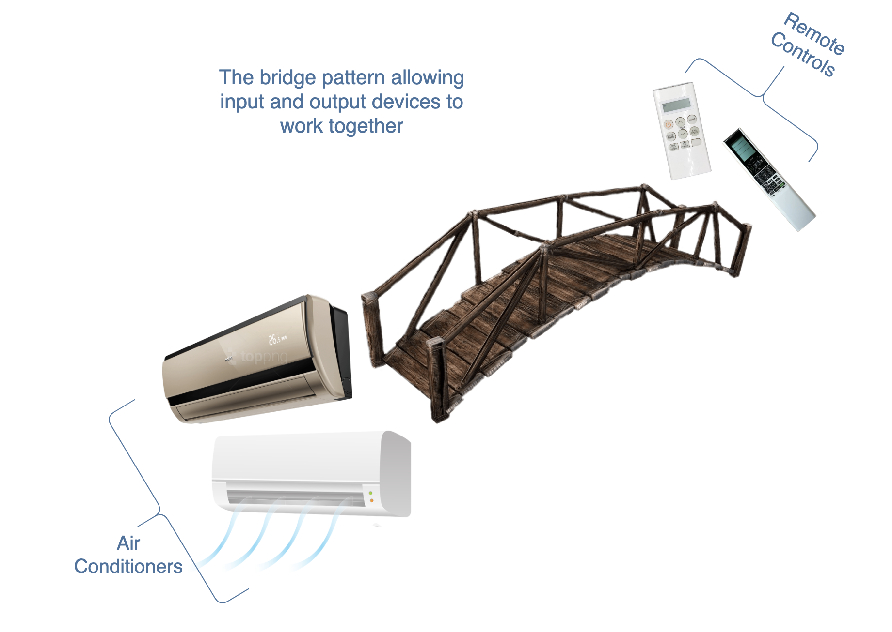

An example is controlling an air conditioner with a remote. The air conditioners can be of different types and each of them is controlled by a different remote. The remotes can vary, that is, a new one with better features can be introduced, but that won’t make any changes to the air conditioner classes. The same goes the other way round. The bridge pattern allows input and output devices to work together but vary independently.

```js
class SimpleRemoteControl{
  constructor(ac){
    this.ac = ac;

    this.on = function() {
        this.ac.on();
    };

    this.off = function() {
        this.ac.off();
    };

    this.setTemperature = function(temp) {
        this.ac.setTemperature(temp);
    };
  }
};

class InverterRemoteControl {
  constructor(ac){
    this.ac = ac;
  

    this.heat = function() {
      this.ac.heatOn();
    };

    this.cold= function() {
      this.ac.coldOn();
    };

    this.on = function() {
        this.ac.on();
    };

    this.off = function() {
        this.ac.off();
    };

    this.setTemperature = function(temp) {
        this.ac.setTemperature(temp);
    };
  }
};


class SimpleAC {
  constructor(){
    this.on = function() {
        console.log('Simple AC is on');
    };

    this.off = function() {
        console.log('Simple AC is off');
    };

    this.setTemperature = function(temp) {
        console.log(`Simple AC's cooling is set to ` + temp + ' degrees');
    };
  }
}

class InverterAC {
  constructor(){
    this.setting = "cool"

    this.on = function() {
        console.log('Inverter AC is on');
    };

    this.off = function() {
        console.log('Inverter AC is off');
    };

    this.heatOn = function(){
      this.setting = "heat"
      console.log("Inverter AC's heating is on")
    };

    this.coldOn = function() {
      this.setting = "cool"
      console.log("Inverter AC's cooling is on")
    };

    this.setTemperature = function(temp) {
      if(this.setting == "cool"){
        console.log(`Inverter AC's cooling is set to ` + temp + ' degrees');
      }
      if(this.setting == "heat"){
         console.log(`Inverter AC's heating is set to ` + temp + ' degrees');
      }
        
    };
  }
}

const simpleAC = new SimpleAC()
const inverterAC = new InverterAC()

const simpleRemote = new SimpleRemoteControl(simpleAC)
const inverterRemote = new InverterRemoteControl(inverterAC)

simpleRemote.on()
simpleRemote.setTemperature(16)
simpleRemote.off()

inverterRemote.on()
inverterRemote.heat()
inverterRemote.setTemperature(22)
inverterRemote.off()
```

__When to use the bridge pattern?__

You can use the bridge pattern if you want to:

- extend a class in several independent dimensions

- change the implementation at run time

- share the implementation between objects

## Composite Pattern

The composite pattern is used to structure objects in a tree-like hierarchy. Here, each node of the tree can be composed of either child node(s) or be a leaf (no children objects). This pattern allows the client to work with these components uniformly, that is, a single object can be treated exactly how a group of objects is treated.

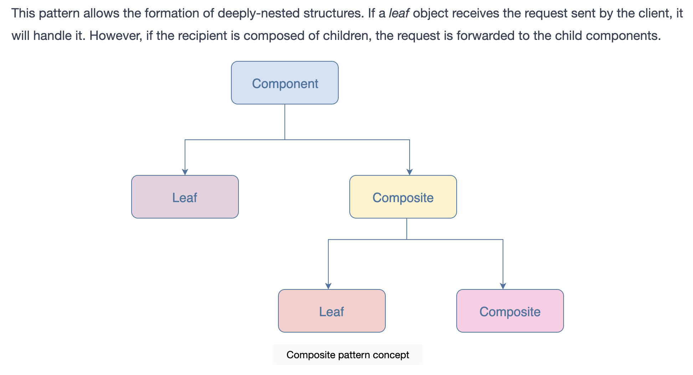 

From the diagram, you can see that a composite pattern consists of the following:

Component: an abstract class that contains methods such as add, remove, get that are used in managing the children. The component can be a leaf object or composite.

Composite: it is the subclass that implements a component. It is composed of other components (children).

Leaf: it is the subclass that implements a component. It does not have children.

```js
//Component
  class Employee{
      constructor(name,position,progress){
          this.name = name
          this.position = position
          this.progress = progress
      }
      getProgress(){
      }
  }
  
  //Leaf subclass
  class Developers extends Employee{
      constructor(name,position,progress){
          super(name,position,progress)
      }
      getProgress(){
          return this.progress
      }
  }
  
  //Leaf subclass
  class FreeLanceDev extends Employee{
      constructor(name,position,progress){
          super(name,position,progress)
      }
      getProgress(){
          return this.progress()
      }
  }
  
  //Composite subclass
  class DevTeamLead extends Employee{
      constructor(name,position){
          super(name,position)
          this.teamMembers = []
      }
      addMember(employee){
          this.teamMembers.push(employee)
      }
  
      removeMember(employee){
         for(var i=0; i<this.teamMembers.length; i++){
             if(this.teamMembers[i] == employee){
                 this.teamMembers.splice(i,1)
             }
         }
         return this.teamMembers
      }
  
      getProgress(){
           for(var i=0; i<this.teamMembers.length; i++){
              console.log(this.teamMembers[i].getProgress())
          }
      }
   
      showTeam(){
          for(var i=0; i<this.teamMembers.length; i++){
              console.log(this.teamMembers[i].name)
          }
      }
  }
  
  const seniorDev = new Developers("Rachel","Senior Developer","60%")
  const juniorDev = new Developers("Joey","Junior Developer", "50%")
  const teamLead = new DevTeamLead("Regina", "Dev Team Lead","90%")
  teamLead.addMember(seniorDev)
  teamLead.addMember(juniorDev)
  console.log("Team members list:")
  teamLead.showTeam()
  console.log("Get Team members progress:")
  teamLead.getProgress()
  console.log("Removing Rachel from team:")
  teamLead.removeMember(seniorDev)
  console.log("Updated team members list:")
  teamLead.showTeam()
  const freelanceDev = new Developers("Ross", "Free Lancer", "80%")
  console.log("Get freelance developer's progress:")
  console.log(freelanceDev.getProgress()) 
```

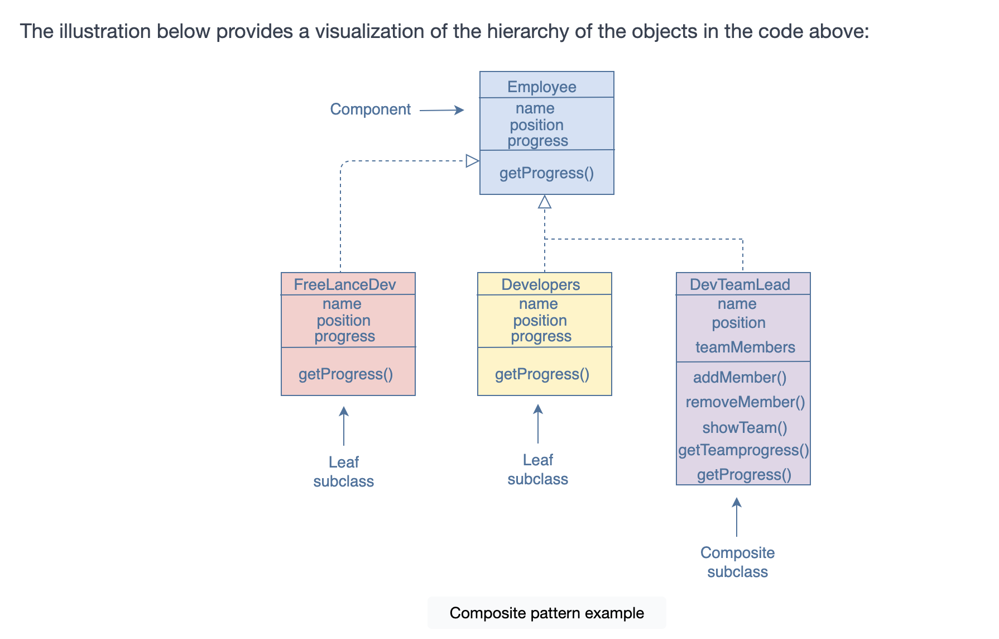 

From the illustration above, you can see the hierarchy of the objects. The pattern consists of the following:

Component: Employee class that includes the abstract method, getProgress, and properties of an employee such as name, position, and work progress.

Leaf: Developers and FreeLanceDev are both Employee's subclasses. They are the leaf components as they have no children. Both have a getProgress function that returns the progress of the developer/freelancer.

Composite DevTeamLead is the composite subclass. It has other developers as its children.

__When to use the composite pattern?__

The composite pattern is powerful as it allows us to treat an object as a composite. Since both single and composite objects share the same interface, it allows reusing objects without worrying about their compatibility.

You can use this pattern if you want to develop a scalable application that uses plenty of objects. It is particularly helpful in situations where you are dealing with a tree-like hierarchy of objects. An example of this pattern is being used by your operating system to create directories and subdirectories. Libraries like React and Vue also use this pattern to build reusable interfaces.

## Flyweight Pattern

It is a structural pattern that focuses on how related objects share data. It helps prevent repetitive code and increases efficiency when it comes to data sharing as well as conserving memory.

This pattern takes the common data structures/objects that are used by a lot of objects and stores them in an external object (flyweight) for sharing. You could say that it is used for caching purposes. So, the same data does not need to have separate copies for each object, instead, it is shared amongst all.

A flyweight is an independent object that can be used in multiple contexts simultaneously. It cannot be distinguished from the instances of objects that are not sharable. A flyweight object can consist of two states:

- intrinsic: this state is stored in the flyweight. It contains the information required by the internal methods of objects. It is independent of the context of the flyweight and is sharable with other objects.

- extrinsic: this state depends on the context of the flyweight and it cannot be shared. Normally, the client objects pass the extrinsic state to the flyweight object when needed.

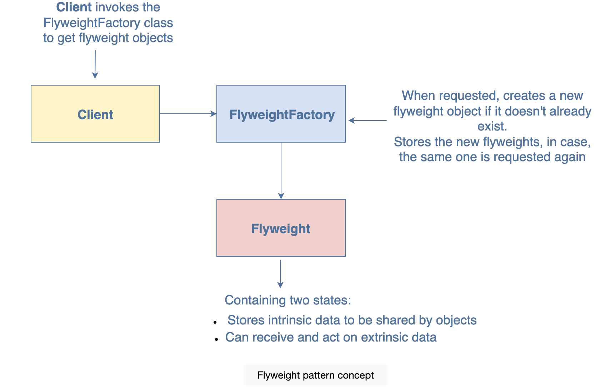

```js
class CodeFile {
    constructor(codefileName){
        this.codefileName = codefileName
    }
}

 
class Formatter {
    format(codefile){}
}

 
class PythonFormatter extends Formatter {
 
    constructor(){
        super()
        console.log("Python Formatter instance created")
    }
     
   
    format(codefileName) {
        console.log(`"Formatting the Python ${codefileName} file you uploaded.`)
    }
 
}

class JavaFormatter extends Formatter {
 
    constructor(){
        super()
        console.log("Java Formatter instance created")
    }
     
   
    format(codefileName) {
        console.log(`"Formatting the Java ${codefileName} file you uploaded.`)
    }
 
}


class FormatterFactory {
  constructor() {
    this.myFormatterMap = new Map()
  }

  createFormatter(formatterType) {
    let formatter = this.myFormatterMap.get(formatterType)
    if (formatter == null) {
      if(formatterType == "Python"){
        formatter = new PythonFormatter()
      }
      else if(formatterType == "Java"){
        formatter = new JavaFormatter()
      }
      this.myFormatterMap.set(formatterType, formatter);
    }
    return formatter
  }
}

const codefile1 = new CodeFile("helloworld.py")
let formatter = new FormatterFactory()
const pythonFormatter = formatter.createFormatter("Python")
pythonFormatter.format(codefile1.codefileName)
//uploading new codefile Python file
const codefile2 = new CodeFile("test.py")
const anotherPythonFormatter = formatter.createFormatter("Python")
anotherPythonFormatter.format(codefile2.codefileName)
console.log("Both Python Formatter instances are the same? " + (anotherPythonFormatter === pythonFormatter))
//uploading a Java file
const codefile3 = new CodeFile("myfile.java")
const javaFormatter = formatter.createFormatter("Java")
javaFormatter.format(codefile3.codefileName)
```

__When to use the flyweight pattern?__

This pattern should be used when your application has plenty of objects using similar data or when memory storage cost is high. JavaScript uses this pattern to share a list of immutable strings across the application.

This pattern is mostly used in applications like network apps or word processors. It can also be used in web browsers to prevent loading the same images twice. The flyweight pattern allows caching of images. Therefore, when a web page loads, only the new images are loaded from the Internet, the already existing ones are fetched from the cache.

## Proxy Pattern
As the name implies, the proxy pattern is a structural pattern that creates a proxy object. It acts as a placeholder for another object, controlling the access to it.

Usually, an object has an interface with several properties/methods that a client can access. However, an object might not be able to deal with the clients’ requests alone due to heavy load or constraints such as dependency on a remote source that might cause delays (e.g., network requests). In these situations, adding a proxy helps in dividing the load with the target object.

The proxy object looks exactly like the target object. A client might not even know that they are accessing the proxy object instead of the target object. The proxy handles the requests from the clients and forwards them to the target object, preventing undue pressure on the target.

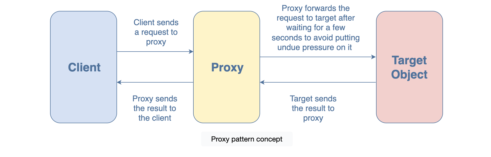
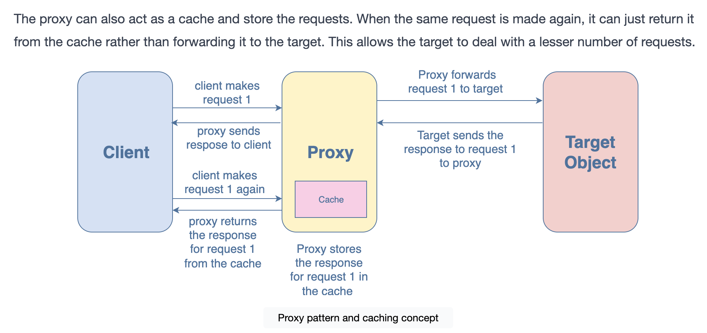

```js
class GetCapital{
   getMycapital(country) {
        if (country === "Pakistan") {
            return "Islamabad";
        } else if (country === "India") {
            return "New Delhi";
        } else if (country === "Canada") {
            return "Ottawa";
        } else if (country === "Egypt") {
            return "Cairo";
        } else {
            return "";
        }
    }
}
 
class ProxyGetCapital {
  constructor(){
    this.capital = new GetCapital()
    this.cache = {};
  }

  getMycapital(country){
    if(!this.cache[country]){
      var value = this.capital.getMycapital(country)
      this.cache[country] = value
      return `${value}--Returning From GetCapital`
    }else{
      return `${this.cache[country]}--Returning from Cache`
    }
    
  }
};
 

var capital = new ProxyGetCapital();
console.log(capital.getMycapital("Pakistan"))
console.log(capital.getMycapital("India"))
console.log(capital.getMycapital("Canada"))
console.log(capital.getMycapital("Egypt"))
console.log(capital.getMycapital("Egypt"))
console.log(capital.getMycapital("Egypt"))
console.log(capital.getMycapital("Pakistan"))
console.log(capital.getMycapital("Pakistan"))
console.log(capital.getMycapital("Canada"))
```

__When to use the proxy pattern?__

The proxy pattern tries to reduce the workload on the target object. You can use it when dealing with heavy applications that perform a lot of network requests. Since delays could occur when responding to such requests, using a proxy pattern will allow the target object to not get overburdened with requests.

A real-life example is HTTP requests. These are expensive operations, therefore, the proxy pattern helps in reducing the number of requests forwarded to the target.