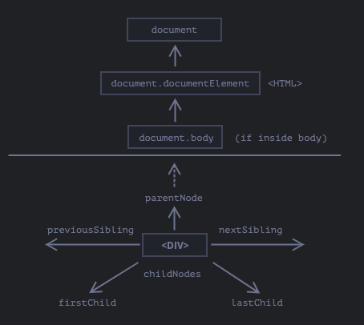
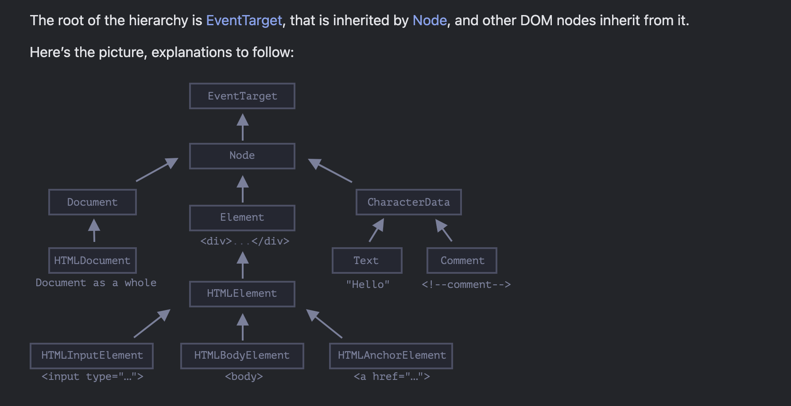
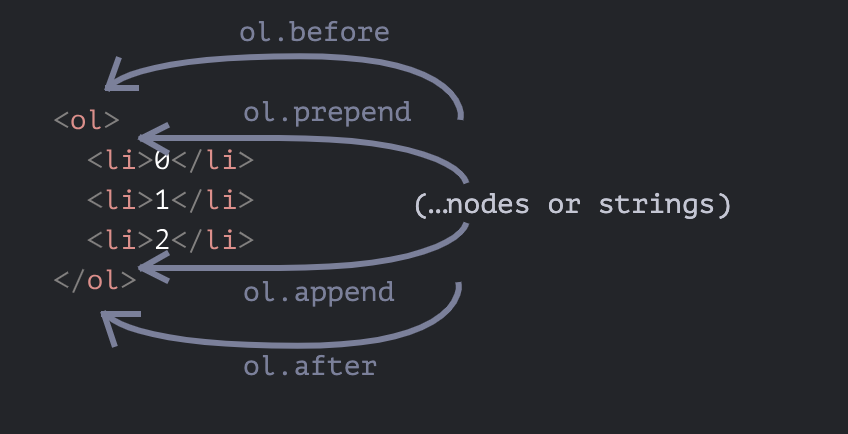
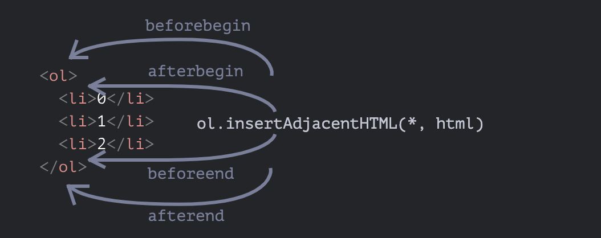
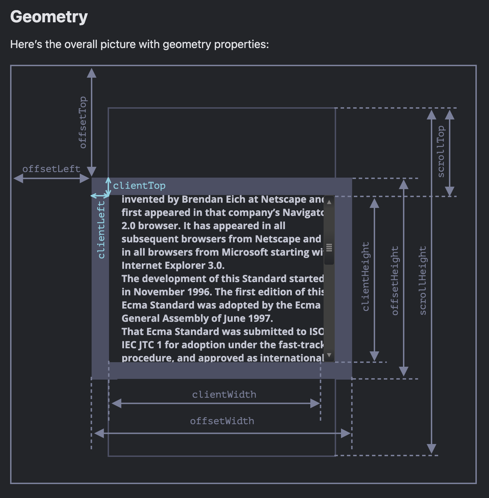
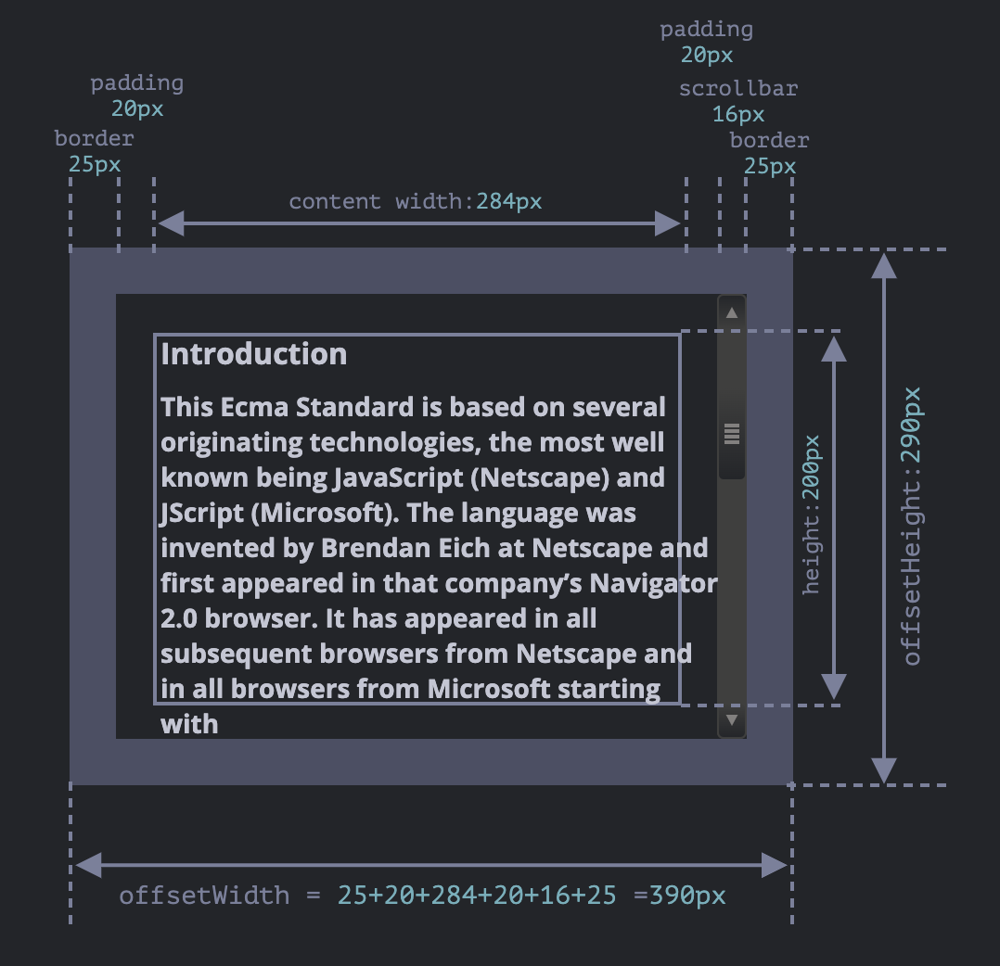
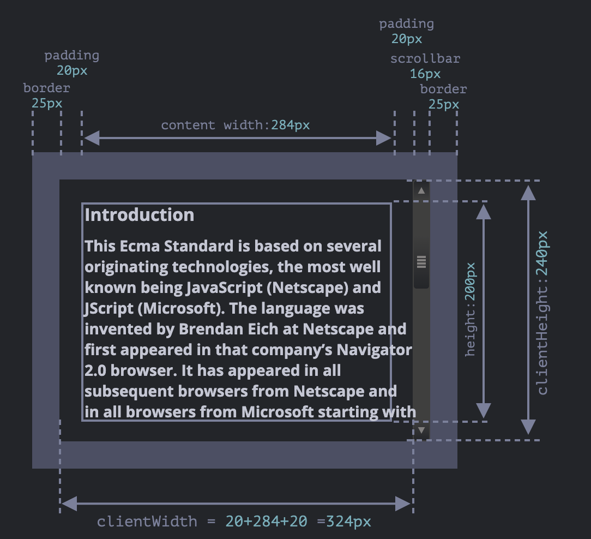
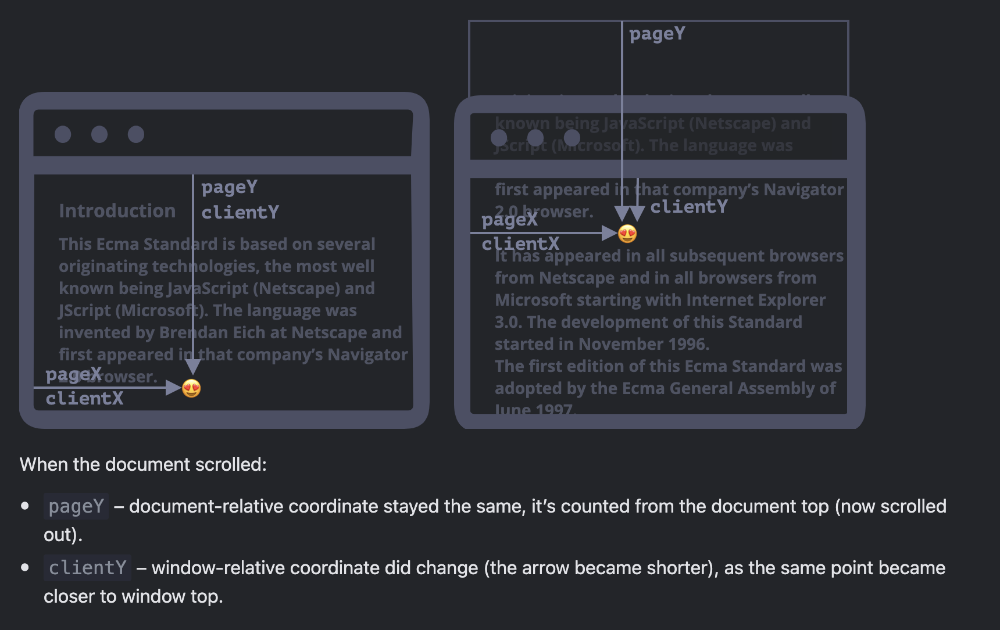
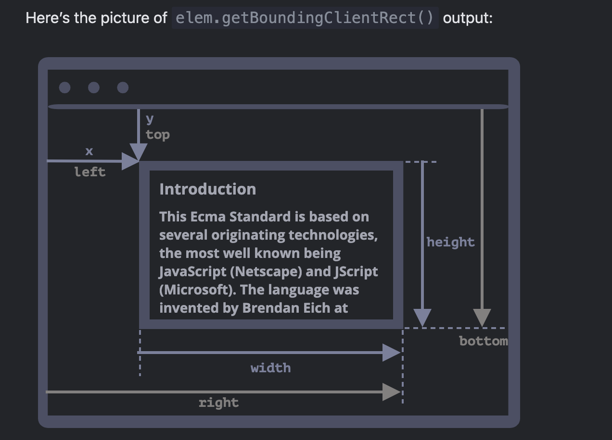

# Browser: Document, Events, Interfaces
## Document


### DOM (Document Object Model)
The document object is the main “entry point” to the page. We can change or create anything on the page using it.

### BOM (Browser Object Model)
The Browser Object Model (BOM) represents additional objects provided by the browser (host environment) for working with everything except the document.

### Walking the DOM



Given a DOM node, we can go to its immediate neighbors using navigation properties.

There are two main sets of them:

- For all nodes: parentNode, childNodes, firstChild, lastChild, previousSibling, nextSibling.
- For element nodes only: parentElement, children, firstElementChild, lastElementChild, previousElementSibling, nextElementSibling.

Some types of DOM elements, e.g. tables, provide additional properties and collections to access their content.


```html
<html> = document.documentElement
<body> = document.body
<head> = document.head

<script>
    for (let i = 0; i < document.body.childNodes.length; i++) {
      alert( document.body.childNodes[i] ); // Text, DIV, Text, UL, ..., SCRIPT
    }
  </script>
```

`In the DOM, the null value means “doesn’t exist” or “no such node”.`

`Properties firstChild and lastChild give fast access to the first and last children.`

```html
elem.childNodes[0] === elem.firstChild
elem.childNodes[elem.childNodes.length - 1] === elem.lastChild
```
`There’s also a special function elem.hasChildNodes() to check whether there are any child nodes.`

### Siblings and the parent

```html
// parent of <body> is <html>
alert( document.body.parentNode === document.documentElement ); // true

// after <head> goes <body>
alert( document.head.nextSibling ); // HTMLBodyElement

// before <body> goes <head>
alert( document.body.previousSibling ); // HTMLHeadElement
```

```
The links are similar to those given above, just with Element word inside:

children – only those children that are element nodes.
firstElementChild, lastElementChild – first and last element children.
previousElementSibling, nextElementSibling – neighbor elements.
parentElement – parent element.
```

```
The <table> element supports (in addition to the given above) these properties:

table.rows – the collection of <tr> elements of the table.

table.caption/tHead/tFoot – references to elements <caption>, <thead>, <tfoot>.

table.tBodies – the collection of <tbody> elements (can be many according to the standard, but there will always be at least one – even if it is not in the source HTML, the browser will put it in the DOM).
<thead>, <tfoot>, <tbody> elements provide the rows property:

tbody.rows – the collection of <tr> inside.
<tr>:

tr.cells – the collection of <td> and <th> cells inside the given <tr>.
tr.sectionRowIndex – the position (index) of the given <tr> inside the enclosing <thead>/<tbody>/<tfoot>.
tr.rowIndex – the number of the <tr> in the table as a whole (including all table rows).
<td> and <th>:

td.cellIndex – the number of the cell inside the enclosing <tr>.
```

The method elem.closest(css) looks for the nearest ancestor that matches the CSS-selector. The elem itself is also included in the search.

- elem.getElementsByTagName(tag) looks for elements with the given tag and returns the collection of them. The tag parameter can also be a star "*" for “any tags”.
- elem.getElementsByClassName(className) returns elements that have the given CSS class.
- document.getElementsByName(name) returns elements with the given name attribute, document-wide. Very rarely used.



https://javascript.info/basic-dom-node-properties

### Modifying the document

Methods to create new nodes:

- document.createElement(tag) – creates an element with the given tag,
- document.createTextNode(value) – creates a text node (rarely used),
- elem.cloneNode(deep) – clones the element, if deep==true then with all descendants.

Insertion and removal:

- node.append(...nodes or strings) – insert into node, at the end,
- node.prepend(...nodes or strings) – insert into node, at the beginning,
- node.before(...nodes or strings) –- insert right before node,
- node.after(...nodes or strings) –- insert right after node,
- node.replaceWith(...nodes or strings) –- replace node.
- node.remove() –- remove the node.
Text strings are inserted “as text”.



There are also “old school” methods:

- parent.appendChild(node)
- parent.insertBefore(node, nextSibling)
- parent.removeChild(node)
- parent.replaceChild(newElem, node)
All these methods return node.

Given some HTML in html, elem.insertAdjacentHTML(where, html) inserts it depending on the value of where:

- "beforebegin" – insert html right before elem,
- "afterbegin" – insert html into elem, at the beginning,
- "beforeend" – insert html into elem, at the end,
- "afterend" – insert html right after elem.
Also there are similar methods, elem.insertAdjacentText and elem.insertAdjacentElement, that insert text strings and elements, but they are rarely used.




To append HTML to the page before it has finished loading:

- document.write(html)

### Styles and classes

To manage classes, there are two DOM properties:

- className – the string value, good to manage the whole set of classes.
- classList – the object with methods add/remove/toggle/contains, good for individual classes.

To change the styles:

- The style property is an object with camelCased styles. Reading and writing to it has the same meaning as modifying individual properties in the "style" attribute. 

- The style.cssText property corresponds to the whole "style" attribute, the full string of styles.

To read the resolved styles (with respect to all classes, after all CSS is applied and final values are calculated):
- The getComputedStyle(elem, [pseudo]) returns the style-like object with them. Read-only.

### Element size and scrolling




The offsetParent is the nearest ancestor that the browser uses for calculating coordinates during rendering.

```HTML
<main style="position: relative" id="main">
  <article>
    <div id="example" style="position: absolute; left: 180px; top: 180px">...</div>
  </article>
</main>
<script>
  alert(example.offsetParent.id); // main
  alert(example.offsetLeft); // 180 (note: a number, not a string "180px")
  alert(example.offsetTop); // 180
</script>
```



For our sample element:

- offsetWidth = 390 (the outer width, can be calculated as inner CSS-width (300px) plus paddings (2 * 20px) and borders (2 * 25px).)
- offsetHeight = 290 (the outer height.)

Inside the element we have the borders.

To measure them, there are properties clientTop and clientLeft.

In our example:

- clientLeft = 25 (left border width)
- clientTop = 25 (top border width)

clientWidth/Height properties provide the size of the area inside the element borders.
They include the content width together with paddings, but without the scrollbar:


Elements have the following geometry properties:

- offsetParent – is the nearest positioned ancestor or td, th, table, body.
- offsetLeft/offsetTop – coordinates relative to the upper-left edge of offsetParent.
- offsetWidth/offsetHeight – “outer” width/height of an element including borders.
- clientLeft/clientTop – the distances from the upper-left outer corner to the upper-left inner (content + padding) corner. For left-to-right OS they are always the widths of left/top borders. For right-to-left OS the vertical scrollbar is on the left so clientLeft includes its width too.
- clientWidth/clientHeight – the width/height of the content including paddings, but without the scrollbar.
- scrollWidth/scrollHeight – the width/height of the content, just like clientWidth/- clientHeight, but also include scrolled-out, invisible part of the element.
- scrollLeft/scrollTop – width/height of the scrolled out upper part of the element, starting from its upper-left corner.
All properties are read-only except scrollLeft/scrollTop that make the browser scroll the element if changed.

### Window sizes and scrolling

Geometry:

Width/height of the visible part of the document (content area width/height): document.documentElement.clientWidth/clientHeight

Width/height of the whole document, with the scrolled out part:
```javascript
let scrollHeight = Math.max(
  document.body.scrollHeight, document.documentElement.scrollHeight,
  document.body.offsetHeight, document.documentElement.offsetHeight,
  document.body.clientHeight, document.documentElement.clientHeight
);

alert('Full document height, with scrolled out part: ' + scrollHeight);
```

Scrolling:
Read the current scroll: window.pageYOffset/pageXOffset.

Change the current scroll:
- window.scrollTo(pageX,pageY) – absolute coordinates,
- window.scrollBy(x,y) – scroll relative the current place,
- elem.scrollIntoView(top) – scroll to make elem visible (align with the top/bottom of the window).

### Coordinates
Most JavaScript methods deal with one of two coordinate systems:

1. Relative to the window – similar to position:fixed, calculated from the window top/left edge.
we’ll denote these coordinates as clientX/clientY, the reasoning for such name will become clear later, when we study event properties.
2. Relative to the document – similar to position:absolute in the document root, calculated from the document top/left edge.
we’ll denote them pageX/pageY.

The two coordinate systems are connected by the formula:

- pageY = clientY + height of the scrolled-out vertical part of the document.
- pageX = clientX + width of the scrolled-out horizontal part of the document.




## Introduction to Events

An event is a signal that something has happened. All DOM nodes generate such signals (but events are not limited to DOM).

Mouse events:
- click – when the mouse clicks on an element (touchscreen devices generate it on a tap).
- contextmenu – when the mouse right-clicks on an element.
- mouseover / mouseout – when the mouse cursor comes over / leaves an element.
- mousedown / mouseup – when the mouse button is pressed / released over an element.
- mousemove – when the mouse is moved.

Keyboard events:
- keydown and keyup – when a keyboard key is pressed and released.

Form element events:
- submit – when the visitor submits a <form>.
- focus – when the visitor focuses on an element, e.g. on an <input>.

Document events:
- DOMContentLoaded – when the HTML is loaded and processed, DOM is fully built.

CSS events:
- transitionend – when a CSS-animation finishes.

### Bubbling and capturing
The standard DOM Events describes 3 phases of event propagation:

Bubbling:
 
Capturing:
- Capturing phase – the event goes down to the element.
- Target phase – the event reached the target element.
- Bubbling phase – the event bubbles up from the element.

```js
elem.addEventListener(..., {capture: true})

// or, just "true" is an alias to {capture: true}
elem.addEventListener(..., true)
```

`event.stopPropagation() and event.stopImmediatePropagation()`

### Event delegation
Capturing and bubbling allow us to implement one of the most powerful event handling patterns called event delegation.

The idea is that if we have a lot of elements handled in a similar way, then instead of assigning a handler to each of them – we put a single handler on their common ancestor.

```html
<div id="menu">
  <button data-action="save">Save</button>
  <button data-action="load">Load</button>
  <button data-action="search">Search</button>
</div>

<script>
  class Menu {
    constructor(elem) {
      this._elem = elem;
      elem.onclick = this.onClick.bind(this); // (*)
    }

    save() {
      alert('saving');
    }

    load() {
      alert('loading');
    }

    search() {
      alert('searching');
    }

    onClick(event) {
      let action = event.target.dataset.action;
      if (action) {
        this[action]();
      }
    };
  }

  new Menu(menu);
</script>
```

The “behavior” pattern

We can also use event delegation to add “behaviors” to elements declaratively, with special attributes and classes.

The pattern has two parts:

- We add a custom attribute to an element that describes its behavior.
- A document-wide handler tracks events, and if an event happens on an attributed element – performs the action.

```html
// Behavior: Counter
Counter: <input type="button" value="1" data-counter>
One more counter: <input type="button" value="2" data-counter>

<script>
  document.addEventListener('click', function(event) {

    if (event.target.dataset.counter != undefined) { // if the attribute exists...
      event.target.value++;
    }

  });
</script>

// Behavior: Toggler
<button data-toggle-id="subscribe-mail">
  Show the subscription form
</button>

<form id="subscribe-mail" hidden>
  Your mail: <input type="email">
</form>

<script>
  document.addEventListener('click', function(event) {
    let id = event.target.dataset.toggleId;
    if (!id) return;

    let elem = document.getElementById(id);

    elem.hidden = !elem.hidden;
  });
</script>
```

### Browser default actions
Many events automatically lead to certain actions performed by the browser.

For instance:
- A click on a link – initiates navigation to its URL.
- A click on a form submit button – initiates its submission to the server.
- Pressing a mouse button over a text and moving it – selects the text.

Preventing browser actions
There are two ways to tell the browser we don’t want it to act:

- The main way is to use the event object. There’s a method event.preventDefault().
- If the handler is assigned using on<event> (not by addEventListener), then returning false also works the same.

```html
<a href="/" onclick="return false">Click here</a>
or
<a href="/" onclick="event.preventDefault()">here</a>
```

### Dispatching custom events
Event constructor

```
let event = new Event(type[, options]);
```

Arguments:
- type – event type, a string like "click" or our own like "my-event".
- options – the object with two optional properties:
    - bubbles: true/false – if true, then the event bubbles.
    - cancelable: true/false – if true, then the “default action” may be prevented. Later we’ll see what it means for custom events.
    
    By default both are false: {bubbles: false, cancelable: false}.

dispatchEvent

    After an event object is created, we should “run” it on an element using the call elem.dispatchEvent(event).

```html
<button id="elem" onclick="alert('Click!');">Autoclick</button>
<script>
  let event = new Event("click");
  elem.dispatchEvent(event);
</script>


<h1 id="elem">Hello from the script!</h1>
<script>
  // catch on document...
  document.addEventListener("hello", function(event) { // (1)
    alert("Hello from " + event.target.tagName); // Hello from H1
  });

  // ...dispatch on elem!
  let event = new Event("hello", {bubbles: true}); // (2)
  elem.dispatchEvent(event);

  // the handler on document will activate and display the message.

</script>
```
Notes:
- We should use addEventListener for our custom events, because on<event> only exists for built-in events, document.onhello doesn’t work.
- Must set bubbles:true, otherwise the event won’t bubble up.

## UI Events

### Mouse events
- mousedown/mouseup

    Mouse button is clicked/released over an element.
- mouseover/mouseout
    
    Mouse pointer comes over/out from an element.
- mousemove
    
    Every mouse move over an element triggers that event.
- click
    
    Triggers after mousedown and then mouseup over the same element if the left mouse button was used.
- dblclick

    Triggers after two clicks on the same element within a short timeframe. Rarely used nowadays.
- contextmenu

    Triggers when the right mouse button is pressed. There are other ways to open a context menu, e.g. using a special keyboard key, it triggers in that case also, so it’s not exactly the mouse event.

Events order

`mousedown → mouseup → click.`

Mouse button

| Button state             | event.button |
|--------------------------|--------------|
| Left button (primary)     | 0            |
| Middle button (auxiliary) | 1            |
| Right button (secondary)  | 2            |
| X1 button (back)          | 3            |
| X2 button (forward)       | 4            |

Modifiers: shift, alt, ctrl and meta

Event properties:

- shiftKey: Shift
- altKey: Alt (or Opt for Mac)
- ctrlKey: Ctrl
- metaKey: Cmd for Mac

```html
<button id="button">Alt+Shift+Click on me!</button>

<script>
  button.onclick = function(event) {
    if (event.altKey && event.shiftKey) {
      alert('Hooray!');
    }
  };
</script>
```

Coordinates: clientX/Y, pageX/Y

All mouse events provide coordinates in two flavours:

- Window-relative: clientX and clientY.
- Document-relative: pageX and pageY.

Preventing copying
If we want to disable selection to protect our page content from copy-pasting, then we can use another event: oncopy.

```html
<div oncopy="alert('Copying forbidden!');return false">
  Dear user,
  The copying is forbidden for you.
  If you know JS or HTML, then you can get everything from the page source though.
</div>
```

### Moving the mouse: mouseover/out, mouseenter/leave

Events mouseover/mouseout, relatedTarget
The mouseover event occurs when a mouse pointer comes over an element, and mouseout – when it leaves.


<a href="https://javascript.info/mousemove-mouseover-mouseout-mouseenter-mouseleave
">please read more</a>


### Drag'n'Drop with mouse events

<a href="https://javascript.info/mouse-drag-and-drop
">please read more</a>

### Pointer events
Pointer event types

| Pointer event        | Similar mouse event |
|----------------------|---------------------|
| `pointerdown`        | `mousedown`         |
| `pointerup`          | `mouseup`           |
| `pointermove`        | `mousemove`         |
| `pointerover`        | `mouseover`         |
| `pointerout`         | `mouseout`          |
| `pointerenter`       | `mouseenter`        |
| `pointerleave`       | `mouseleave`        |
| `pointercancel`      | -                   |
| `gotpointercapture`  | -                   |
| `lostpointercapture` | -                   |

Pointer event properties

Pointer events have the same properties as mouse events, such as clientX/Y, target, etc., plus some others:

- pointerId – the unique identifier of the pointer causing the event.

    Browser-generated. Allows us to handle multiple pointers, such as a touchscreen with stylus and multi-touch (examples will follow).

-   pointerType – the pointing device type. Must be a string, one of: “mouse”, “pen” or “touch”.

    We can use this property to react differently on various pointer types.

- isPrimary – is true for the primary pointer (the first finger in multi-touch).

<a href="https://javascript.info/pointer-events">please read more</a>

### Keyboard: keydown and keyup

Keydown and keyup

The keydown events happens when a key is pressed down, and then keyup – when it’s released.

<a href="https://javascript.info/keyboard-events">please read more</a>

### Scrolling

```js
window.addEventListener('scroll', function() {
  document.getElementById('showScroll').innerHTML = window.pageYOffset + 'px';
});
```

## Forms, controls

### Events: change, input, cut, copy, paste

```js
// Event: change
<input type="text" onchange="alert(this.value)">
<input type="button" value="Button">

// Event: input 
<input type="text" id="input"> oninput: <span id="result"></span>
<script>
  input.oninput = function() {
    result.innerHTML = input.value;
  };
</script>

// Events: cut, copy, paste
<input type="text" id="input">
<script>
  input.onpaste = function(event) {
    alert("paste: " + event.clipboardData.getData('text/plain'));
    // event.preventDefault();
  };

  input.oncut = input.oncopy = function(event) {
    alert(event.type + '-' + document.getSelection());
    // event.preventDefault();
  };
</script>
```

### Document and resource loading

The lifecycle of an HTML page has three important events:

- DOMContentLoaded – the browser fully loaded HTML, and the DOM tree is built, but external resources like pictures  and stylesheets may not yet have loaded.
- load – not only HTML is loaded, but also all the external resources: images, styles etc.
- beforeunload/unload – the user is leaving the page.

Each event may be useful:
- DOMContentLoaded event – DOM is ready, so the handler can lookup DOM nodes, initialize the interface.
- load event – external resources are loaded, so styles are applied, image sizes are known etc.
- beforeunload event – the user is leaving: we can check if the user saved the changes and ask them whether they really want to leave.
- unload – the user almost left, but we still can initiate some operations, such as sending out statistics.

```html

 <script>
        window.addEventListener("load", (event) => {
            console.log('ashis loading')
          // works, same as returning from window.onbeforeunload
        //   event.returnValue = "There are unsaved changes. Leave now?";
        });
        window.addEventListener("beforeunload", (event) => {
            console.log('ashis beefore unloading')
          // works, same as returning from window.onbeforeunload
          event.returnValue = "There are unsaved changes. Leave now?";
        });
</script>

```

## Miscellaneous

### Mutation observer
MutationObserver is a built-in object that observes a DOM element and fires a callback when it detects a change.

```js
let observer = new MutationObserver(callback);
observer.observe(node, config);
```
config is an object with boolean options “what kind of changes to react on”:
- childList – changes in the direct children of node,
- subtree – in all descendants of node,
- attributes – attributes of node,
- attributeFilter – an array of attribute names, to observe only selected ones.
- characterData – whether to observe node.data (text content),

<a href="https://javascript.info/mutation-observer">Read more</a>

### Selection and Range

<a href="https://javascript.info/selection-range">Read here</a>